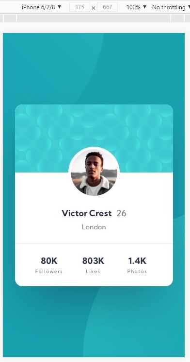
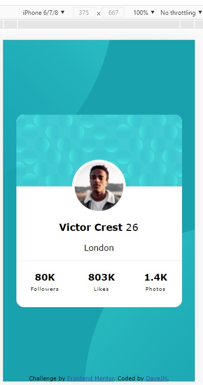

# Frontend Mentor - Profile card component solution

This is a solution to the [Profile card component challenge on Frontend Mentor](https://www.frontendmentor.io/challenges/profile-card-component-cfArpWshJ). Frontend Mentor challenges help you improve your coding skills by building realistic projects. 

## Table of contents

- **[Overview](#overview)**
  - [Backstory](#backstory)
  - [The Challenge](#The-Challenge)
- **[Progress](#progress)**
  - [HTML](index.html) *- File*
  - [CSS](assets/css/style.css) *- File*
  - [How To Help](#How-To-Help)
  - [Key Areas](#Key-Areas)
- **[Images](#Images)**
- **[Author](#author)**
#

# Overview:

## Backstory

I recently attempted this challenge and was fairly happy with the visual result.  The link to the replit is ***[here](https://replit.com/@DaveJH/BusinessCard-Explain)***.

I think the HTML is poorly written (by me!) but I continued with it, to try and learn more about position and other CSS styling.  I am now trying to re-write the HTML and CSS into a better format.  I have done OK so far - *I think!!*

## The Challenge

- Build out the project to the designs provided in the design folder.
  - [Desktop](design/desktop-design.jpg)
  - [Mobile](design/mobile-design.jpg)
  - [Design/Styles](style-guide.md)

# Progress:

Please take a look at the [HTML](index.html) and [CSS](assets/css/style.css) files and let loose with all your constructive criticisms. 

## How To Help
 I am ***very*** early into coding and know I have a lot to learn.  I like to understand *why* things work the way they do so any help with that is very much appreciated.
 
 I would ask for help in the following way if it is possible (but I will take all I can get!):

 - Write any extra code with a /* <-- comment--> */ above the extra code.
 - If my code is poor, please comment it out and add annotations to explain what is wrong with it.
 - Give general feedback on the writing, format, styles....anything you can!
    - I need to re-do the shape and size of the background circles.
    - The top bubbles section is slightly out compared to the 'original'.
    - TEXT!!

## Key Areas

- I would really like to get the text to look neater and smaller.  I have experimented with some things but have not been happy with any results.  It may be that I have taken the wrong approach from the start with styling, so I may be way off track here.
- Is it possible to add (or remove) some opacity from the background circles.  The original looks less prominent than mine.
- I think I can work on the spacing once the text is sorted...hopefully!

# Images
  

#

# Author
- [LinkedIn](https://linkedin.com/in/davejhorrocks)
- Frontend Mentor Profile - [@DaveyJH](https://www.frontendmentor.io/profile/DaveyJH)

